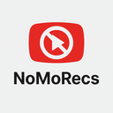

  

<h1 align="center">NoMoRecs - YouTube Recommendation Blocker</h1>

  
  

## Overview

**NoMoRecs** is a lightweight Chrome extension designed to help users focus on their chosen content by blocking YouTube's recommendation algorithm. Whether you're working, studying, or just want to avoid the rabbit hole of endless video suggestions, NoMoRecs helps you stay on track with your intended viewing.

## Features

- **Block Video Recommendations**: Eliminates the recommended videos sidebar on video pages
- **Hide Homepage Suggestions**: Removes algorithmically suggested content from the YouTube homepage
- **Expand Video Player**: Automatically expands the video player to use the full width of your screen
- **Preserve Subscriptions**: Keeps your subscription feed intact so you can still see content from channels you follow
- **Simple Interface**: Easy-to-use toggle with visual status indicator
- **Zero Configuration**: Works immediately after installation with no setup required

## How It Works

NoMoRecs employs a dual-approach strategy to block YouTube recommendations:

1. **CSS Manipulation**: Hides recommendation containers in the YouTube interface
2. **Dynamic Monitoring**: Uses MutationObserver to ensure recommendations stay hidden as you navigate YouTube

## Installation

### From Chrome Web Store

Install NoMoRecs directly from the [Chrome Web Store](https://chrome.google.com/webstore/detail/)

### Manual Installation

1. Download and extract the latest release
2. Open Chrome and navigate to `chrome://extensions/`
3. Enable "Developer mode" (toggle in the top-right corner)
4. Click "Load unpacked" and select the extracted extension folder
5. NoMoRecs is now installed and active!

## Usage

- **Toggle On/Off**: Click the extension icon to open the popup, then use the toggle switch to enable or disable recommendation blocking
- **Visual Status**: The popup displays whether recommendations are currently blocked or allowed
- **Immediate Effect**: Changes take effect instantly without requiring page refresh

## Technical Details

NoMoRecs is built with:

- Manifest V3 API
- DOM manipulation via content scripts
- MutationObserver for monitoring dynamic content changes
- Chrome Storage API for maintaining settings
- Targeted permissions for YouTube domains only

## Privacy Policy

Please refer to our [Privacy Policy](https://shubhs27.github.io/NoMoRecs/privacy-policy) for information about data collection and privacy practices.

## Contributing

If you have ideas to improve this extension or have found a bug, please open an issue to discuss your ideas or report the problem. Pull requests are also welcome.

## License

This project is licensed under the MIT License - see the LICENSE file for details.

## Acknowledgements

Chrome Extension documentation and tutorials at [developer.chrome.com](https://developer.chrome.com/docs/extensions) were invaluable resources during development - their clear explanations and examples make extension development accessible and straightforward.
